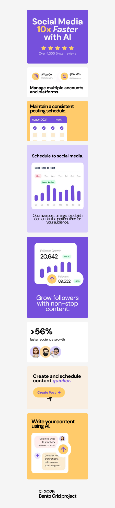

# Frontend Mentor - Bento grid solution

This is a solution to the [Bento grid challenge on Frontend Mentor](https://www.frontendmentor.io/challenges/bento-grid-RMydElrlOj). Frontend Mentor challenges help you improve your coding skills by building realistic projects. 

## Table of contents

- [Overview](#overview)
  - [The challenge](#the-challenge)
  - [Screenshot](#screenshot)
  - [Links](#links)
- [My process](#my-process)
  - [Built with](#built-with)
  - [What I learned](#what-i-learned)
  - [Continued development](#continued-development)
  - [Useful resources](#useful-resources)
- [Author](#author)
- [Acknowledgments](#acknowledgments)

**Note: Delete this note and update the table of contents based on what sections you keep.**

## Overview

### The challenge

Users should be able to:

- View the optimal layout for the interface depending on their device's screen size

### Screenshot

## My process

### Built with

- Semantic HTML5 markup
- CSS custom properties
- Flexbox
- CSS Grid

### What I learned

This is my first time working on this type of project, and it was a good challenge for me. I was able to practice my HTML and CSS skil, and I understood it takes practice upon practice to become a good programmer/developer. Things like responsiveness, overflowing image, transforming image, merging CSS grid and flexbox, display, positioning etc, was more comprehensive while I was working on this project and the internet was my friend honestly.

### Continued development

I will be working on more advance CSS/HTML, because they have a lot of components.

### Useful resources

- [Example resource 1](https://www.appbrewery.com/) - This helped me to kick off as a developer. I really liked this teaching pattern and will use it going forward.
- [Example resource 2](https://www.developer.mozilla.org) - This is an amazing article which helped me finally understand some concepts in this project. I'd recommend it to anyone still learning this concept.

## Author

- Frontend Mentor - [@Degreatdo](https://www.frontendmentor.io/profile/Degreatdo)

## Acknowledgments

Shoutout to Dr. Angela Yu for her great teaching skills, she makes learning programming seem easy.
